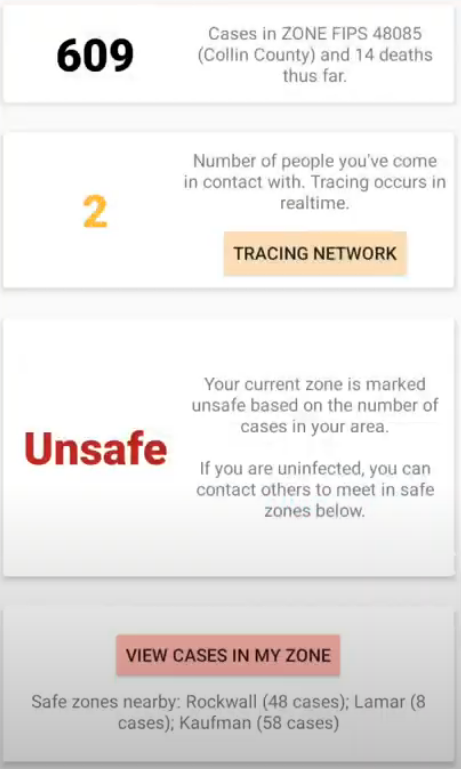
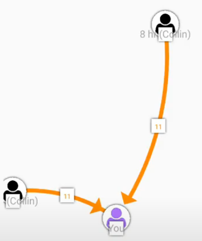
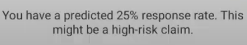

SafeZone is a mobile app that traces your exposure to COVID-19, in order to better assess life insurance claims through machine learning. 

By algorithmically designating safe zones (with few cases and a low mortality rate), the virus can be contained. Furthermore, with the relaxation of lockdowns, safe zones will provide a place for healthy people to meet without anxiety, as well as enjoy the natural world.

## Problem
The spread of COVID-19 is difficult to quantify.
* Unknown spread of the virus creates problems for insurers to accurately assess risk for life insurance claims during this time. 
* A shortage of food and increased chaos creates difficulty in accurately tracing the movement of infected people.
* There are several areas (_zones_) with _few_ COVID-19 cases.
* As lockdown restrictions are relaxed, healthy people can meet up at these zones, to trade supplies or enjoy the environment -- such as parks and the great outdoors. 

<!-- > "This is \[nature's\] warning shot... It's human behaviour that causes it and there will be more in the future unless we change." (Andrew Cunningham, Zoological Society of London) -->

## Solution
* Using publicly available data at the county level, SafeZone designates zones with few COVID-19 cases, and implements an accurate **contact-tracing method** to generate a network of people that you contact, simply through a Bluetooth exchange of anonymous IDs. Non-infected people can travel to safe-zones and interact with others, without feeling anxious.
<!--If someone begins to feel symptoms of COVID-19, all they hve to do is update their profile, which sends an alert to everyone they've contacted, warning them to stay home and prevent further spread of the virus.-->

* The **tracing network** that is generated by this app, will carry valuable data for insurers. It directly quantifies an individual's **level of exposure** to the virus, which can be used to predict assessment for life insurance policies. A machine learning model that accepts parameters for level of exposure to COVID-19 as a medical factor, was used to assess life insurance claims.

* This idea is highly scalable. The current prototype works with counties in Texas, but publicly available data will allow designation of safe zones throughout the United States.

The home page:

A small network:

Predicted response for a sample claim:

